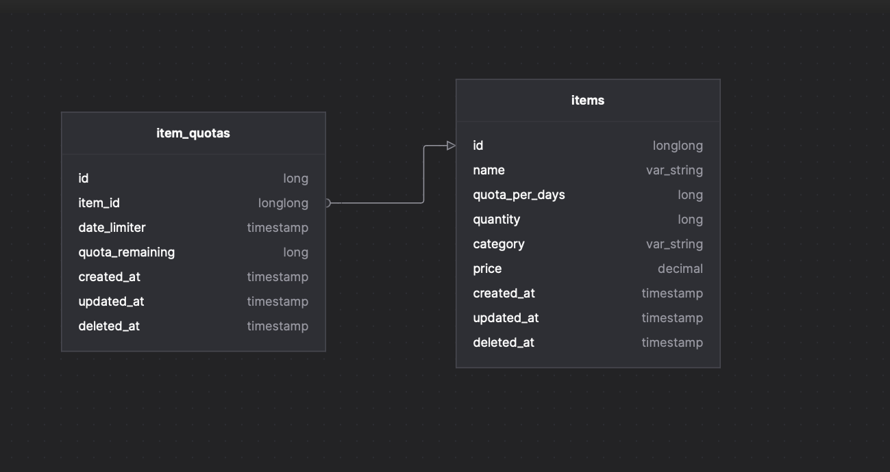
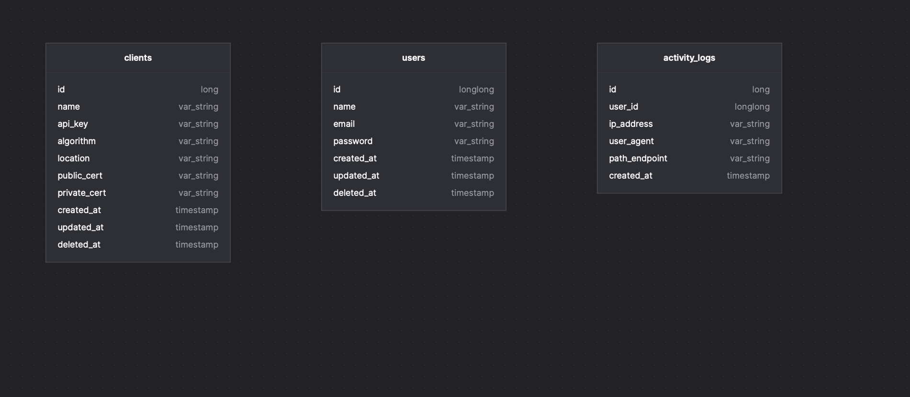

# MONO REPO GUE Ecosystem Test

This repo including some services where is; product service for handling related of item or products; order service for handling checkout flow with additional can cancel the order; auth service for handling the authorization client and authentication user flow; and the API gateway by using Krakend.

## Requirement
1. Go 1.17 or above (download [here](https://golang.org/dl/)).
2. Git (download [here](https://git-scm.com/downloads)).
3. Docker

## Note For Reviewer(s):
Due to time constraints, since my load on my current company. Here may be some considerations and things to pay attention to:
- Haven't had time to finish yet to provide caching and pagination mechanism
- Details what field i must to record not really clear, so i just added to my side
- Checkout flow i assuming that can only checkout with single existing order without can't update the cart, since by the instruction is no update cart.
- Haven't had time to providing an event-driven or message-driven mechanism for handling _failure flow_ like rollback status as before when increment/decrement item is failed when cancel or checkout order
- For OAuth2 mechanism, i'm not using repo [go-oauth2](https://github.com/go-oauth2/oauth2.), since not `customizable`. I manually create my own which keep using the standardization is [jwt](https://datatracker.ietf.org/doc/html/rfc7519)
- I'm not abstraction all the packages is in used, since there is no need yet
- On gateway, i not setup for production env. Just prepared for local env "Mac M1 Custom plugin unsupported relocation type"
- I usually manage the response message dynamically, but for now i'm not provided it
- I really sorry can finish the gateway for running well. Since i have issue "unsupported relocation type" for build my custom plugin on Mac M1.
  
  >   but i'm still trying to find out the issue.

## Diagram
### product db

### order db

### auth db


## How To Setup
### Project
clone the source locally:
```shell
$ git clone https://github.com/verryp/gue-eco-test.git <your-name-project>
$ cd <your-name-project>
```

Copy all of the example env file and make the required configuration changes in the `../cfg.yaml` file
```shell
$ cp deployment/auth/cfg.yaml.example deployment/auth/cfg.yaml
$ cp deployment/order/cfg.yaml.example deployment/order/cfg.yaml
$ cp deployment/product/cfg.yaml.example deployment/product/cfg.yaml
```

Start the local development server
```shell
$ make run
```

You can now access the server at http://localhost:<server-port>/health

### Database & Migration
Before running the migration, firstly, you must create new databases on your database platform/tool for each service. For my references db naming:
- `gue_eco_auth_db`
- `gue_eco_product_db`
- `gue_eco_order_db`

Then, go in on each container for running the migration:
#### Order
```shell
$ docker exec -it gue-order sh

/go/src/github.com/verryp/gue-eco-test # ./order migrate-up
```
#### Product
```shell
$ docker exec -it gue-product sh

/go/src/github.com/verryp/gue-eco-test # ./product migrate-up
```
#### Auth
```shell
$ docker exec -it gue-auth sh

/go/src/github.com/verryp/gue-eco-test # ./auth migrate-up
```

## How To Use
Me encouraging makefile to operate this project. Each command has its own scope & roles.
Use `make help` to see complete command and details.

- Run service, `make run`
- Update all dependencies, `make dep`
- Run unit test, `make test`
- Manage container, `make compose.up`, `make compose.down`, `make compose.clean`

## How to contribute
1. Create your feature branch (`git checkout -b [feat/fix/ref]-foo-bar`)
2. Commit your changes (`git commit -am 'feat: add some fooBar'`)
3. Push to the branch (`git push origin [feat/fix/ref]-foo-bar`)
4. Create a new Merge Request, please use this template when submitting a MR